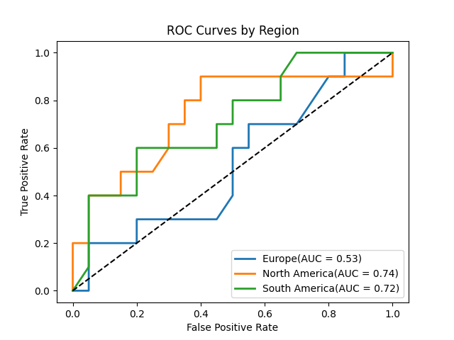
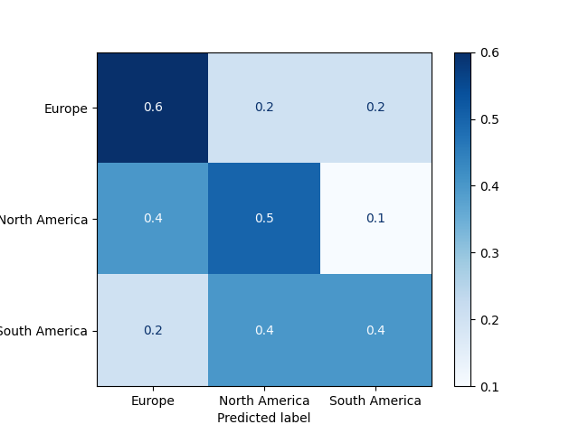

############################################################
Random dummy Baseline 0.4

                    precision    recall  f1-score   support

    Europe              0.40      0.40      0.40        10

    North America       0.38      0.30      0.33        10

    South America       0.42      0.50      0.45        10

        accuracy                           0.40        30
       macro avg       0.40      0.40      0.40        30
    weighted avg       0.40      0.40      0.40        30

############################################################
randomForestClassifier
0.5333333333333333
        
                        precision    recall  f1-score   support

           Europe       0.30      0.30      0.30        10
    North America       0.58      0.70      0.64        10
    South America       0.75      0.60      0.67        10

     accuracy                           0.53        30
    macro avg       0.54      0.53      0.53        30
 weighted avg       0.54      0.53      0.53        30

############################################################
############################################################
LogisticRegression
0.43333333333333335

                        precision    recall  f1-score   support

           Europe       0.38      0.30      0.33        10
    North America       0.47      0.70      0.56        10
    South America       0.43      0.30      0.35        10

     accuracy                           0.43        30
    macro avg       0.42      0.43      0.42        30
    weighted avg       0.42      0.43      0.42        30

############################################################

Overall the best classifier has been through a random forest though the most feature it has used was the occurrences of cards with a lot of more information about them to add such as the avg elixir for a deck and also the type of card it is not just based on the name. That would have to be web scraped for future development. The next step is to up the number of samples per region and the numbers of regions as right now the only was used are North America, South America and Europe. The plan is to keep the logistic regressor and the random forest. Though the name of the cards help determine what region

